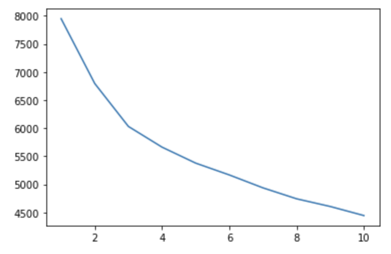
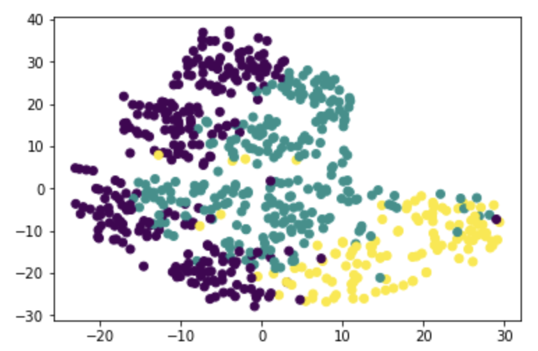

# Myopia Prediction Clusters

In this assignment, we were tasked with exploring the `myopia.csv` dataset to determine if the patients in it could be grouped into clusters for separate analysis.

### Part 1: Prepare the data
I started by removing the target column from the dataset that contained the actual diagnosis of the patients. Then I used `StandardScaler()` to scale the data.

### Part 2: Apply Dimensionality Reduction

I used Principle Component Analysis to reduce the dimensionality of the data set to contain approximately 91.8% of the original data. The assignment specified for us to use an `n_components` value of `0.9`.

I then ran a t-SNE model with the default learning rate of 200 to reduce the dimensionality further. When graphed, there were not any pronounced clusters.

### Part 3: Perform Cluster Analysis with K-Means

In this step, I used k-means to see if any clusters exist among the patients in the dataset. I started by drawing an "elbow curve" to determine what value of k would be best. The most distinct "elbow" appeared to be at 3, so that is what I used for my k value. 

I ran the k-means function on the reduced data and replotted the features from my t-SNE model with the categories determined by the k-means analysis. The resulting plot showed three mostly distinct categories that might be useful for further breaking down the study data.

### Part 4: Make a Recommendation

We can use the groups created by the k-means function to break up the patient data set and see if analyzing the separate clusters improves our model. 
